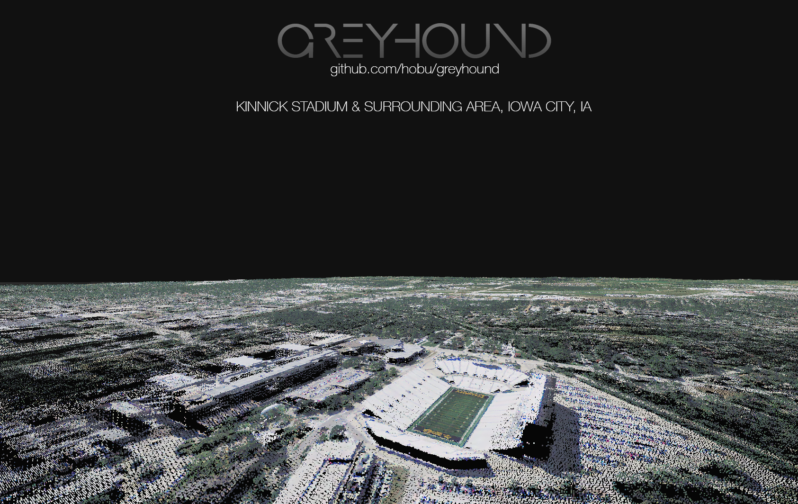

# GREYHOUND

A pointcloud querying and streaming framework over websockets for the web and your native apps.

# Tell me more
_Greyhound_ is powered by [PDAL](http://www.pointcloud.org/) in the background which it uses to query points out of a point cloud source. The queries flow through a variety of systems put in place for scalability and session management.  PDAL sessions are maintained in stand-alone binaries which exist for as long as sessions are active.  See the [overview](https://github.com/hobu/greyhound/blob/master/doc/overview.rst) document for more details.

A json-over-websockets protocol is used to initiate a session and query points.  Point data is streamed as binary data from the server.  See the _examples_ directory on how to query and read data.

# How to hack?
You would need [Vagrant](http://www.vagrantup.com/) installed to play with _Greyhound_.  Once you check out the source code, you'd go into the checked out directory and do a:

	vagrant up
	
This will start the virtual machine.  The first time you do it, it would take a while to set up the virtual machine with all the needed components (some installed from ubuntu repos, some built manually).  Once the process finishes you are ready to log into the machine:

	vagrant ssh
	cd /vagrant/

You now need to run the `set-stuff-up.sh` script to build _Greyhound_ components.  This script builds the C++ components and does a `npm install` in all node.js components directories.

	./set-stuff-up.sh
	
Once this is done, you're ready to play.  We use the `foreman` tool to manage and bring up all components.

	foreman start
	
This should bring all components up.  You can now run examples from the _examples_ directory or navigate to

	http://localhost:8080/
	
To have pointcloud data rendered in a browser.

## Pointcloud Source
Right now the implementation reads in the pipeline description located at `examples/data/read.xml` which uses `autzen.las` (in the same directory) as the source of point data.  You can change the `read.xml` file to read points from whereever you like.

Also, the client side uses pretty rudimentary logic to detect whether color information is available.  Your output needs to have the XYZ dimensions as signed 4-byte integers and, optionally, the RGB dimensions for color information as unsigned 2-byte shorts.  A record size of 18 indicates that color information is available (3 * 4 + 2 * 3) while a record size of 12 indicates no color information.

This will change as we finalize schema transfer.

# License
_Greyhound_ is under **MIT** license and is Copyright [Howard Butler](http://hobu.biz) and [Uday Verma](https://github.com/verma).

last updated: December 26, 2013
